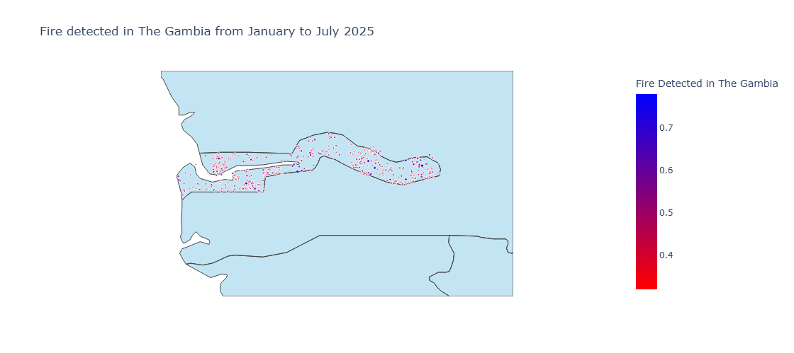

# 🔥 Gambia Fire Data Visualization (NASA VIIRS)

This project visualizes real fire incidents detected in **The Gambia** using satellite data from **NASA's VIIRS instrument**. It displays fire locations, brightness, and intensity for the period **January to July 2025**.

## 📊 Features
- Interactive map showing fire detections in The Gambia
- Data visualized using **Plotly (scattergeo)**
- Filtered by location and detection values
- Fire marker color shows brightness; size reflects scan width

## 🛰️ Data Source
- NASA FIRMS (Fire Information for Resource Management System)  
- Instrument: **VIIRS (Visible Infrared Imaging Radiometer Suite)**  
- Dataset: Near Real-Time (NRT) Active Fire Data

## 📁 File Structure
/data
`fire_data_gm1.json` # Filtered JSON data for The Gambia
`gam_fire_data.html `# Output HTML map visualization

`gam_fire_data.py` # Python script to generate the visualization

README.md # Project description

## 🛠️ Tech Stack
- Python
- Plotly
- JSON
- NASA FIRMS data

## 📍 Output Preview

## 📦 How to Run
1. Clone the repository  
`git clone https://github.com/Musbi8788/gam_fire_data_nasa.git`

2. Navigate into the folder  
`cd gam_fire_data_nasa`

3. Run the Python script  
`python gam_fire_data.py`

4. Open `gam_fire_data.html` in your browser.

## 📬 Contact
Created by [Musbi Jawo](https://github.com/Musbi8788)  
Feel free to contribute or reach out if you have ideas!
